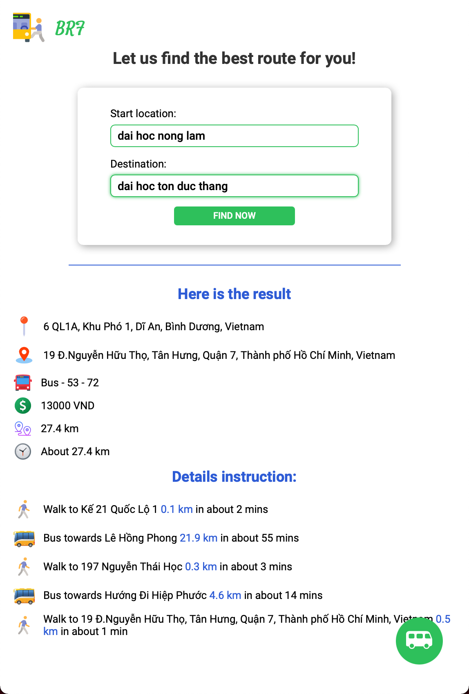

# Best route finder - Let us find the best bus route for you

This is a minimal application that we can use for finding the best bus route around the world, using Google Maps Platform API and buyttphcm API for the data. We use Express.js for the server-side and Vue.js, Vite.js for the client-side of this app.

### Screenshot



## Fell free to use:

-   First of all, you should have Nodejs on your machine. You can install it [here](https://nodejs.org/en/)
-   Because we use Google Maps Platform API for this application, we need an API key for all feature. Unfortunately, we cannot put an API key on the Github's source code. So, for using this project, you'll need to create your own API key. You can found an instruction by Google here: https://developers.google.com/maps. Or if you want an API key just for testing, just leave me an email: 18110102@student.hcmute.edu.vn
-   After that, open terminal/powershell and type:

    ```sh
    git clone https://github.com/doanwebute/BusMapApp
    cd soen-busmap
    npm install -g nodemon # or 'yarn global add nodemon', if you're using yarn package management
    cd server && npm install # or just 'yarn' instead of 'npm install'
    cd ../client && npm install # or just 'yarn' instead of 'npm install'
    ```

-   Then, you should go to `server/index.js`, find this line: `const apiKey = ''`, and paste your API key between two single quotes, like this:

    ```javascript
    const apiKey = 'Your-API-key'
    ```

-   Then go to the `server` folder, type:
    ```sh
    nodemon index.js
    ```
-   And finally, go the the `client` folder, type:
    ```sh
    npm run dev # or 'yarn dev'
    ```

Please report to us if you found any issue. Thank you for supporting us!
